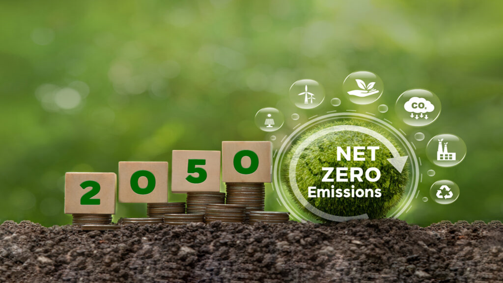
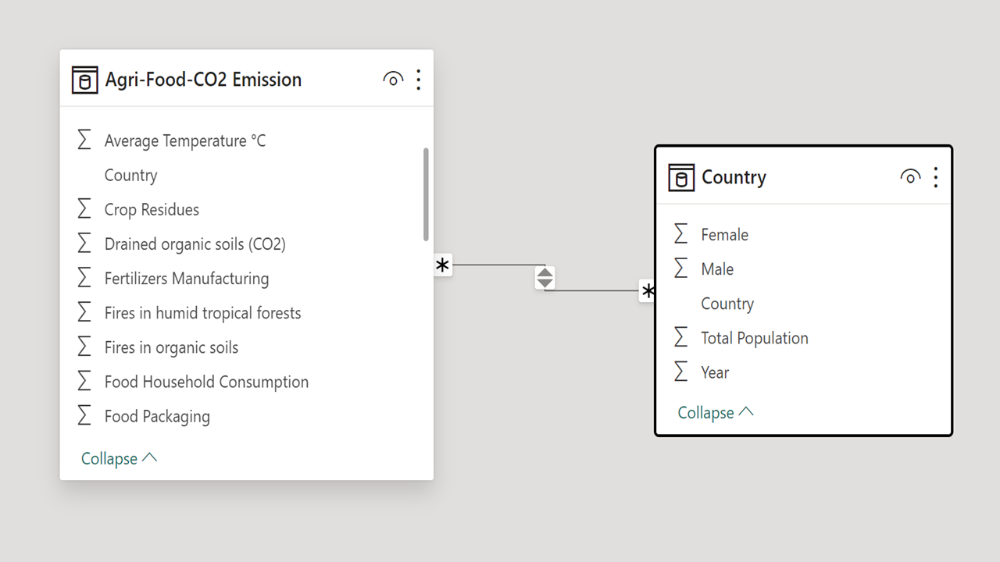
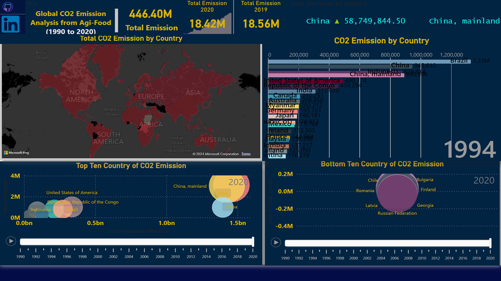
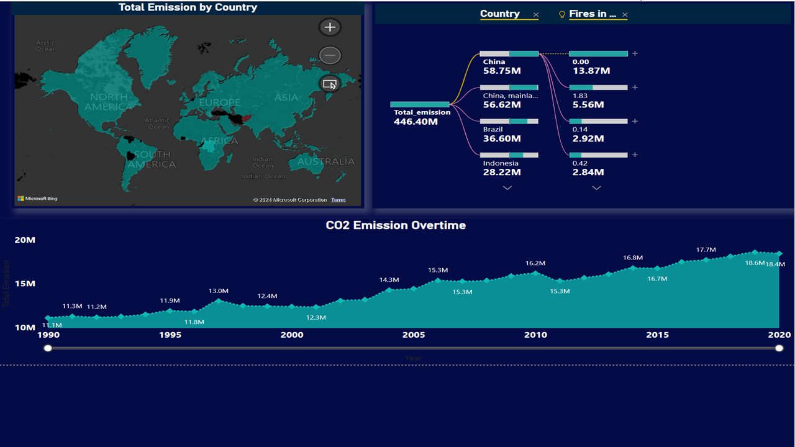
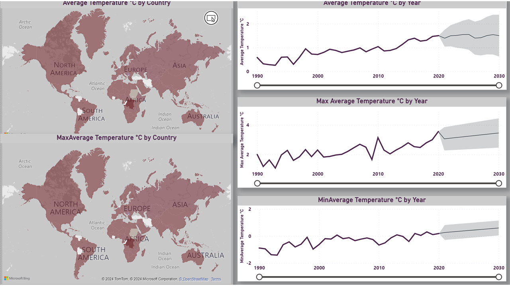

# Agri-Food Emission Analysis

Table of Contents
- [Background](#background)
- [Problem Statement](#problem-statement)
- [Skills Demonstrated](#skills-demonstrated)
- [Modeling](#modeling)
- [Visualization](#visualization)
- [Analysis Highlight](#analysis-highlight)
- [Conclusion](#conclusion)
- [Recommendations](#recommendations)
- [Data Source](#data-source)
  ## Background
Agri-food systems account for one-third of total anthropogenic greenhouse gas (GHG) emissions (Crippa et al., 2021; Tubiello et al., 2021). They are generated within the farm gate, by crop activities; by land-use change, for instancforest land and peatland drainage to make room for agriculture; and in pre- and post-production processes, such as food  manufacturing, retail,household consumption and food disposal (Tubiello et al., 2022).

**_Disclaimer_** : _All datasets and reports do not represent any organizations, institution and country, but just a dummy dataset to demonstrate capabilities of power Bi._
## Problem Statement 
The agri-food system contributes significantly to global CO2 emissions, with variations across countries due to diverse agricultural practices, land use patterns, and levels of industrialization. Therefore,understanding country-specific emissions within the agri-food system is essential for targeted mitigation strategies and policy interventions. The objective of this project is to utilize Power BI to conduct a comprehensive analysis  of CO2 emissions in the agri-food system, focusing on individual countries. The analysis aims to: 
- Collect, clean and integrate relevant data sources from Kaggle Dataset to quantify CO2 emissions associated with agricultural activities, food processing, transportation, and consumption patterns for each country. 
- Visualize and compare CO2 emissions across different stages of the agri-food supply chain within and between countries. 
- Identify key drivers of CO2 emissions in the agri-food system for each country, including agricultural practices, land use changes, and dietary preferences.
- Develop interactive dashboards and reports in Power BI to facilitate data exploration, trend analysis, and scenario planning for policymakers, researchers, and stakeholders.
## Skills Demonstrated
The following Power Bi features were incorporated
- Filter, 
- DAX,
- Modeling,
- Tooltips
- Button
## Modeling
Automatically derived relationships are adjusted to remove and replace relationships with the required.
Adjusted Model
:-----------------------:|
The model is a star schema.
There are one-dimention tables and one fact table. The dimenstion tables are all joined to the fact table with a one-to-many relationships
## Visualization
Out of the total 24 visual reporst the 3 all in one pages are: 
1. Agri-Food Emission
2. Emission-overtime-Top-Emission-drivers
3. Temprature-change-overtime-forecast
   
## Analysis Highlight:
### Summary of agri-Food Emission

In 2020, global agri-food systems emissions were 18.43M tonnes of carbon dioxide equivalent (Gt CO2eq), an increase of 11 percent since 2000 and down 1 percent from 2019. 😢
The share of agri-food systems in total emissions in 2020 (31 percent) confirmed the steady downward trend from the levels of 2000 (38 percent), a consequence of agri-food systems emissions growing significantly more slowly than the rest of the economy, dominated by fossil fuels combustion for energy use. 
- In 2020 the top 5 countries of Agri-food system emitters are China, China, Mainland, USA, India and Brazil and Bottom 5 are Chile, Bulgaria, Romania, Russia and Finland 
### Emission overtime and Top Emission Drivers

Out of the total 21 Agri-food system emission drivers the top 5 are IPPU (Emissions from industrial processes and product use), Net forest conversion, HH consumption, Rice cultivation and food processing
### Change in Temperature

The average teprature have been increasing year by year and the forecast also showed an increasing trend
## Conclusion
- In conclusion, the global agri-food system emission trends are increasing since 1990, due to this fact all actors in the development landscape should give emphasis in this sector to mitigate the impact of the agricultural VC on GHGs emission 
## Recommendations 
- Adoption of Sustainable Agricultural Practices: Encourage and support farmers to adopt sustainable agricultural practices such as precision farming, agroforestry, and organic farming. These practices can help reduce greenhouse gas emissions from agricultural activities such as tillage, fertilizer application, and irrigation, while also enhancing soil health and biodiversity.
- Promotion of Renewable Energy Sources: Promote the use of renewable energy sources such as solar, wind, and biomass energy in the agri-food system. Investing in renewable energy infrastructure for on-farm energy generation, food processing facilities, and transportation can help reduce reliance on fossil fuels and mitigate emissions associated with energy use.
- Improvement of Livestock Management: Implement measures to improve livestock management practices to reduce emissions from enteric fermentation and manure management. Strategies such as dietary modifications, manure management techniques (e.g., anaerobic digestion, composting), and improved herd management can help mitigate methane and nitrous oxide emissions from livestock operations.
- Enhancement of Supply Chain Efficiency: Improve supply chain efficiency and reduce food waste to minimize emissions associated with food processing, storage, and transportation. Adopting technologies such as cold chain management, efficient transportation logistics, and packaging innovations can help reduce energy consumption and emissions throughout the supply chain.
- Research and Innovation: Support research and innovation initiatives aimed at developing low-emission technologies, practices, and products in the agri-food sector. Investing in research on climate-smart agriculture, carbon sequestration techniques, and alternative food production systems can help identify innovative solutions to mitigate emissions while ensuring food security and sustainability.
- Consumer Awareness: Increase consumer awareness about the environmental impact of food choices and empower consumers to make more sustainable food purchasing decisions. Educating consumers about the carbon footprint of different foods, promoting plant-based diets, and supporting local and sustainable food systems can help reduce emissions associated with food consumption.
- Policy Support and Collaboration: Implement supportive policies and regulations at local, national, and international levels to incentivize emission reduction measures in the agri-food system. Foster collaboration between governments, businesses, NGOs, and research institutions to develop and implement comprehensive strategies for emissions mitigation and climate adaptation in the agri-food sector.

You can interact with the [here](https://app.powerbi.com/groups/me/reports/d15d50de-0ca1-440a-a72f-9d7800248ccd/ReportSection?experience=power-bi)
## Data Source
The primary dataset used for this analysis is the "Agri-Food_data.csv from Kaggle dataset

